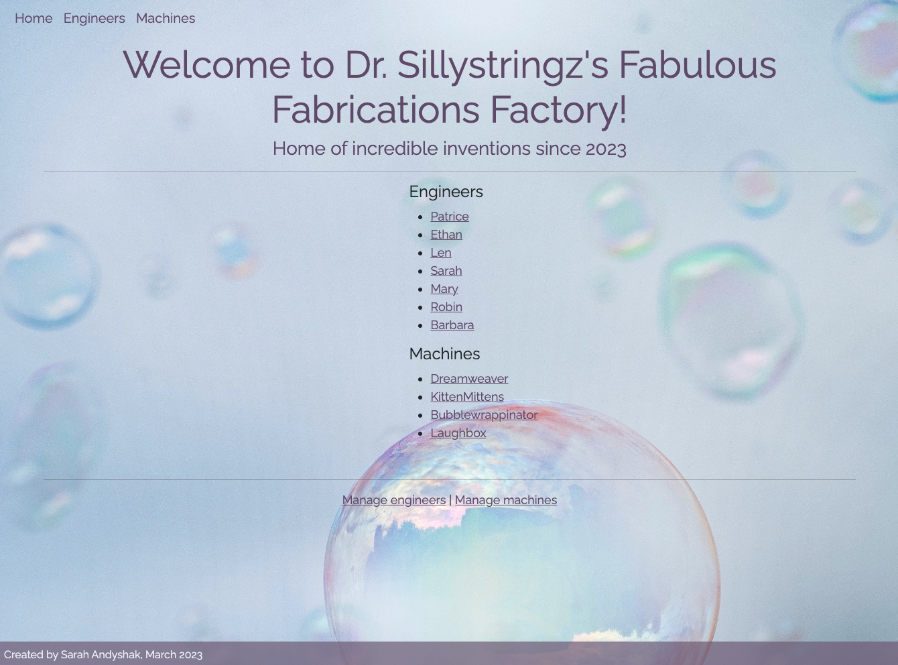
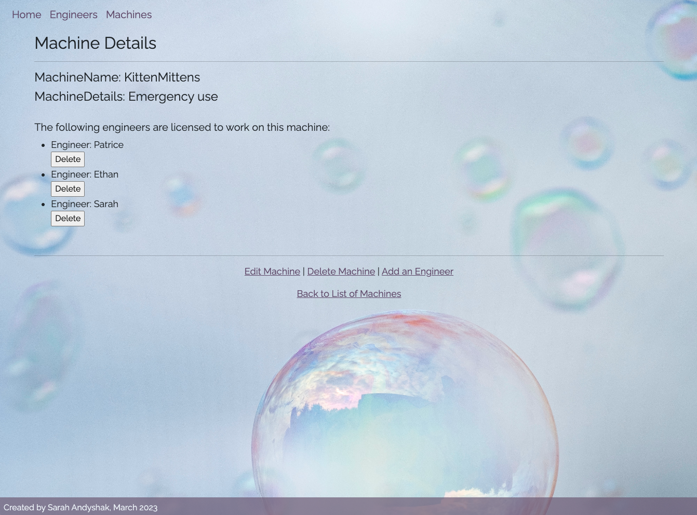

# 💡 Dr. Sillystringz's Fabulous Fabrications Factory 💡

#### By: Sarah Andyshak

## Technologies Used

* C#
* Razor HTML
* VS Code
* .Net 6
* MySQL
* Entity Framework Core 6
* CSS

## Description
A website for the factory to track machines in need of repair and engineers.

Screenshots from this project:



### Setup Instructions

#### You Will Need: 

* A code editor, such as [VS Code](https://code.visualstudio.com/)
* [Git](https://github.com/) installed
* [Install .Net 6 SDK:](https://www.learnhowtoprogram.com/c-and-net/getting-started-with-c/installing-c-and-net)

#### Preliminary Project Set-up:
1. Clone or download this repository to your machine.
2. Navigate to the local directory (YourPath/ProjectName.Solution/ProjectName) and create a new file "appsettings.json".
3. Open the file in VS Code and add:
  ```
  {
    "ConnectionStrings": {
      "DefaultConnection": "Server=localhost;Port=3306;database=[YOUR-DB-NAME];uid=[YOUR-USER-HERE];pwd=[YOUR-PASSWORD-HERE];"
    }
  }
  ```

**IMPORTANT:** Be sure to replace your username, password, and name of your database for the fields [YOUR-USER-HERE], [YOUR-PASSWORD-HERE], AND [YOUR-DB-NAME].

#### Database Migration Set-up:
1. In the root directory, run `dotnet tool install --global dotnet-ef --version 6.0.0`.
2. Navigate to the production directory and run `dotnet add package Microsoft.EntityFrameworkCore.Design -v 6.0.0`.
3. Run `dotnet ef migrations add Initial` to create the initial migration.
4. Update the database with `dotnet ef database update`.

#### Running the Project:
1. Create a .gitignore file and add "appsettings.json", "bin", and "obj" to the ignored file list.  
2. Open your shell (e.g., Terminal or GitBash) and add your .gitignore file and commit it before adding any other files. 
3. Navigate to this project's production directory called "Factory". 
4. In the command line, run the command `dotnet run` to compile and execute the console application. Optionally, you can run `dotnet build` to compile this console app without running it.
5. Run `dotnet watch run` in the command line to start the project in development mode with a watcher.
6. Open the browser to _https://localhost:5001_. If you cannot access localhost:5001 it is likely because you have not configured a .NET developer security certificate for HTTPS. To learn about this, review this lesson: [Redirecting to HTTPS and Issuing a Security Certificate](https://www.learnhowtoprogram.com/c-and-net/basic-web-applications/redirecting-to-https-and-issuing-a-security-certificate).

## Known Bugs

🍀 As of 17 March 2023, no known bugs. 

## License
Enjoy the site! If you have questions or suggestions for fixing the code, please contact me!

[MIT](https://github.com/git/git-scm.com/blob/main/MIT-LICENSE.txt)

Copyright (c) 2023 Sarah Andyshak.